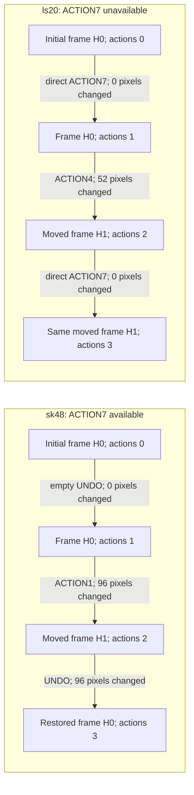

# UNDO restores a frame, not an action budget

These completed CPU measurements show why an agent should treat `ACTION7` as a conditional, charged action. In `sk48`, an available UNDO restored the exact visible frame after movement while the action counter advanced. In `ls20`, ACTION7 was absent from `available_actions`; direct requests returned an unchanged frame and still advanced the counter.

[measured-data.json](measured-data.json) contains only scalar observations, action identifiers and frame hashes. All 11 recorded frame hashes and all nine transition pixel counts were recomputed from the original observations before this report was written. No raw frames or game implementation are included.

`H0` and `H1` are per-game shorthand for the full frame hashes in the JSON. The diagram shows the complete first measured move/UNDO pair in each game. State remained `NOT_FINISHED`, visible level remained 1 and completed levels remained 0 throughout.

| Observed event | ACTION7 listed? | Visible result | Counter change |
|---|---|---|---|
| sk48 empty-history UNDO | Yes | 0 pixels changed | 0→1 |
| sk48 ACTION1 then UNDO | Yes | All 96 changed pixels restored; initial frame hash recovered | 2→3 |
| sk48 second empty-history UNDO | Yes | 0 pixels changed | 3→4 |
| sk48 ACTION4 then UNDO | Yes | All 12 changed pixels restored; initial frame hash recovered | 5→6 |
| ls20 initial direct ACTION7 | No | 0 pixels changed | 0→1 |
| ls20 ACTION4 then direct ACTION7 | No | No restoration; moved frame hash retained | 2→3 |

The practical implication is to consult the current `available_actions`, budget one action for every UNDO, and check the returned observation. A matching image does not mean that the action counter or unobserved state has rolled back.

## Measurement scope and accounting

The actual unmodified offline engine/wrapper ran on macOS arm64 with Python 3.12.14. The public fixtures were `sk48-d8078629` and `ls20-9607627b`, both at seed 0 and visible level 1. There were **14 environment action calls: nine non-RESET calls and five initial RESET calls**. The sk48 total is 10, including three preflight initial resets; the ls20 total is 4. The displayed action counters describe the measured episodes, not a sum including preflight resets.

The two pure Python wheels were imported directly without installation:

| Distribution | SHA256 |
|---|---|
| arcengine-0.9.3-py3-none-any.whl | `5f9739d6d0055780a4581fd6fe09066bb08775c4c8212c9adcca2eb008aef59c` |
| arc_agi-0.9.8-py3-none-any.whl | `aeca1663db342e91cb8fc96cf0c83e2fa39db1640bc1298e80a8d522e3af70f3` |

Frame SHA256 is computed over the row-major unsigned-byte values of the final visible 64×64 frame. Pixel differences count positions whose values changed, without inferring objects or hidden state. The JSON binds both original evidence files by SHA256.

These are observations from two game versions and one seed, not a statistical result. No win, level transition, game-over or reset-after-death behavior was tested. No model, GPU, training or controller was run. Native Kaggle harness behavior, controller compatibility and score improvement remain unverified. This report does not contain answers, baseline values or hidden state.

An earlier broad search incidentally emitted sparse game-source import/action-condition matches. They were unused for action selection and conclusions and are excluded here. Further measurements used observable API responses. Preparing this report performed no additional engine actions and made no Kaggle or GitHub changes.
