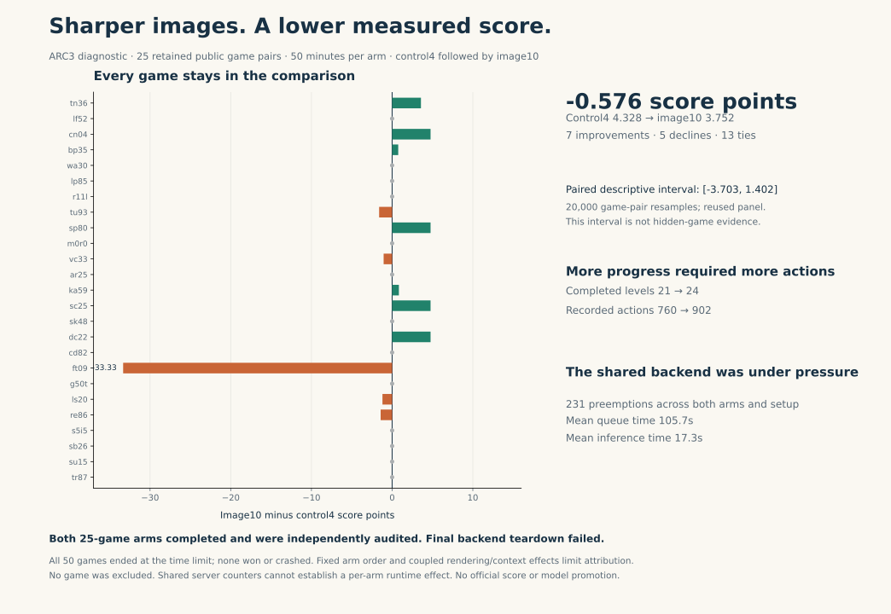

# ARC3 resolution experiment: measured result

Larger images helped the agent reach more levels, but the complete 25-game comparison scored lower. The control averaged **4.328496**, while image10 averaged **3.752271**: a difference of **−0.576225 score points**. We retain every game, including the −33.3333 change on ft09.



Both arms used the same model, analyzer settings, public game panel and 50-minute active budget. The control rendered 256 × 256 images; image10 rendered 640 × 640. The larger-image arm completed 24 levels using 902 recorded actions, compared with 21 levels and 760 actions for the control. This evaluator rewards action efficiency, so reaching more levels does not by itself imply a better score.

The pair has 7 improvements, 5 declines and 13 ties. Its reporting-only paired bootstrap interval is **[−3.703472, 1.401765]**, using 20,000 resamples of the 25 retained game pairs. These reused public games, one model run and fixed control-first order do not establish hidden-game performance. Image resolution also changes the harness's serialized-image context estimate, so the result combines rendering and context effects.

The shared backend recorded 231 preemptions. Its completed requests averaged 105.74 seconds in the queue and 17.28 seconds in inference. These counters cover **both arms and setup together**. They identify a serving bottleneck worth investigating, but cannot attribute a runtime difference to either arm.

All 50 games reached the frozen time limit and were cancelled; none won or crashed. Their final records, scores, histories and seals were checked independently. The paired diagnostic completed before final backend teardown failed. The server's notebook status was COMPLETE, but the teardown gate was FAIL. We preserve both facts. This experiment produced no competition submission and no model promotion.

To reproduce the chart from a repository checkout:

```sh
python -m pip install numpy matplotlib
python examples/measured-resolution/plot_result.py \
  --data experiments/image-resolution-pair/v3/measured-data.json \
  --output ./arc3-measured-result-figures
```

Use a new output directory; the script preserves existing outputs. `measured-data.json` contains all 25 individual paired scores, arm totals, reporting interval, server metrics and provenance. The original frozen [V3 protocol](./protocol.json) records the complete settings. Plotting uses no model, benchmark environment or GPU.

The native run is `prvsiyan/zz-gpuchk-899422`, Version 8, session 355288162. Its source SHA-256 is `2ce3bba1a8fafb90bdb6087696fc8e62cb4445e686933c698c8caed0618b57bd`; the protocol SHA-256 is `1abb91697d175bad8cf45f4f94958914ca71697797e7c8213e21280a334dda13`. The independent terminal audit SHA-256 is `176277d429bcf30f82b0fc1caf82fc9cc54acff482af693495d65eca83c794d7`. A second local reproduction matched its complete audit content apart from the timestamp.

Measured on 5 October 2026. These are diagnostic scores on public games, not an official leaderboard score.
