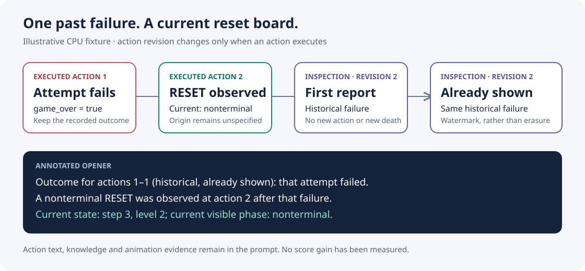

# When the last outcome is history

An ARC3 agent can inspect a board several times without taking a new action. In the pinned harness, those inspections repeat the previous sequence's outcome. After a RESET, the opener can still say “The game is over.” The current board and step are present, but the timing of the announcement is ambiguous.

This directory contains an original, standard-library adapter that labels a sequence as newly observed, historical on its first report, or historical and already shown. It retains the outcome and annotates its time. A later nonterminal RESET is reported only when an actual executed action records it. RESET origin is not inferred.



## What was observed

The retained native run was `prvsiyan/zz-gpuchk-899422`, version 8, session `355288162`. Ten selected traces contain 152 analyzer openers and 19 consecutive repeated announcements at the same displayed action counter: 10 game-over announcements and 9 level-advance announcements. The selection includes four histories with RESET actions. These counts describe this selected sample; they are not a population frequency or a measured score benefit. The compact observation receipt includes the trace and source-retrieval hashes, without raw reasoning, boards or game solutions.

The adapter has only been checked on CPU fixtures. It has not been integrated into a model run, and no leaderboard improvement is claimed.

## Try the annotation

```bash
python3 smoke_feedback.py
```

The smoke example uses synthetic public action metadata. It needs no weights, engine, network access or Kaggle account.

The deeper suite executes selected methods from the exact pinned harness through AST extraction with declared mocks. Supply the two source files in one directory:

```bash
ARC3_PINNED_SOURCE_DIR=/absolute/path/to/source-pair \
  python3 test_feedback_watermark.py
```

The suite checks source hashes before extraction. It covers repeated inspection, retry, RESET, WIN, a level transition followed by another action, a transition followed by failure, distinct session scopes and invalid metadata. It also checks that prompt lines outside the stated annotation boundary remain identical.

## The caller's contract

Pass the original prompt, a complete consecutively indexed list of executed actions, the current frame's level and step, the unmodified last sequence summary, and a distinct `(session, game pass)` scope. `event_from_result` accepts a single executed action result; rejected actions do not advance the history. A batch result must first be expanded into its actual individual action observations.

The summary's outcome flags aggregate the entire executed span, matching the pinned summarizer's `any(...)` behavior. Its final level remains the final action's level. The adapter changes only the canonical sequence-count, outcome and current-state lines. Action text, world-model notes, animation evidence and hints remain in the original prompt. Missing or ambiguous canonical lines, altered history, a regressed summary or incompatible metadata cause a contract error before the watermark advances.

The caller must authenticate the supplied metadata. This adapter does not discover actions, infer successful play from pixels, manage models, reset a game or change a notebook. It retains history per scope and has a diagnostic bound of 100,000 actions; production integration and memory/performance measurements remain future work.

## Provenance

The observed prompt and control flow came from the released [TAAF animation source asset](https://www.kaggle.com/datasets/jakobbrggen/taaf-kaggle-source-anim-20260807-anim), consumed by our retained native run. The source pair is not redistributed here:

| Source file | SHA-256 |
|---|---|
| `tool_agent.py` | `856bf9b895d0ad8b959c8f828c7132b0e09eaa47f4c5cc6173785354090f8be7` |
| `solver.py` | `2bef5d6bc23c0312675f0c7203194c94e93d056ac06bf6419acd5142a4ea7c8e` |

The adapter, smoke example, diagram and explanation are original work under this repository's Apache-2.0 license. The test suite derives executable fixture methods from the caller-supplied source pair rather than shipping the third-party source. `cpu-contract.json` records the completed validation and candidate hashes; `native-observations.json` records the separate native observation. Neither receipt is an official competition score.
