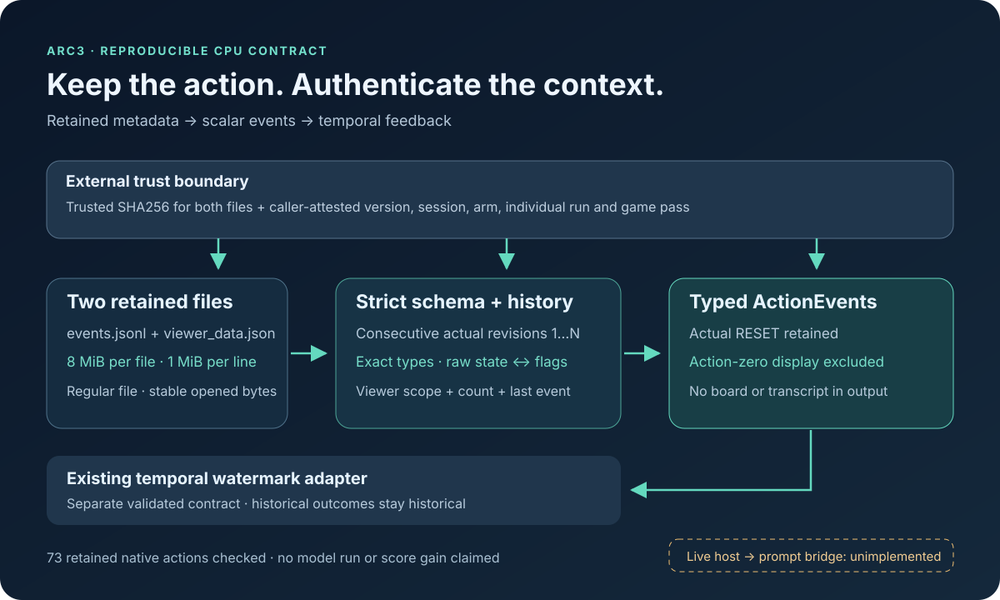

# Retained action traces → typed temporal feedback

This CPU utility connects retained ARC3 action metadata to the `ActionEvent` contract in [the temporal feedback adapter](README.md). It authenticates two retained files, validates their pinned schema and returns scalar action events. It does not run a model, execute a game action or connect feedback to a live agent. No score improvement has been measured.



## Run the contract checks

Use Python 3.10 or newer on a POSIX system, from this directory:

```bash
python test_sidecar_reader.py
```

The synthetic fixtures need only the standard library and the adjacent `feedback_watermark.py`. Two additional tests are enabled by setting `ARC3_NATIVE_METADATA_DIR` to the retained output directory containing the `control4` and `image10` artifact subdirectories. Those tests check fixed SHA256 digests before parsing; arbitrary files under the same names will fail authentication.

The fixtures cover incomplete histories, action counter gaps, initial display anchors, raw outcome flags, mismatched viewer metadata, boolean/integer confusion, nonfinite numbers, duplicate JSON keys, file/line/count limits, symlink rejection and a FIFO with no writer. A genuine executed RESET is retained; the initial row's displayed RESET is excluded.

## Use the reader

```python
from sidecar_reader import Provenance, parse_sidecar

# Obtain both digests and the session identity from a trusted, exact-version
# fetch. The example values below are deliberately not an executable receipt.
identity = Provenance(
    notebook_ref="owner/existing-notebook",
    version=1,
    session_id=1,
    arm="control",
    run_token="unique-individual-run",
    game_id="public-game-id",
    pass_index=0,
)
parsed = parse_sidecar(
    "events.jsonl", "viewer_data.json",
    expected_sidecar_sha256=trusted_sidecar_sha256,
    expected_viewer_sha256=trusted_viewer_sha256,
    provenance=identity,
)
print(parsed.scalar_receipt())
# parsed.events and parsed.scope are inputs for a separately reviewed host
# integration. Constructing this object does not establish live authority.
```

The reader depends on the adjacent, unchanged `ActionEvent` dataclass. See the adapter's own example for watermark updates. A host must establish which actual engine actions belong to its current prompt; this utility cannot establish that relationship from historical files.

## What is checked—and what must be supplied

The viewer file internally binds `game_id`, `pass_index`, `pass_label`, `eventCount` and the last retained event's metadata. Its last historical action may have status `playing` while the final viewer status is `cancelled`; those fields describe different moments. All actual actions must have consecutive revisions starting at one. Raw `WIN`/`GAME_OVER` states must agree with strict boolean outcome flags. Analysis and experiment rows cannot advance the action revision.

Notebook version, numeric session, experiment arm and individual-run identity are **caller-attested**. They are not fields inside these two retained files. A filename or parent directory does not prove them. Both expected SHA256 digests must come from a trusted exact-version fetch. The scope digest includes all supplied identities, including the game pass, solely to separate watermark state; it does not route game policy.

The pinned writer is `solver.py`, SHA256 `2bef5d6bc23c0312675f0c7203194c94e93d056ac06bf6419acd5142a4ea7c8e`, consumed through the retained source-asset receipt SHA256 `3f07a97439d4b958b12d01b36db6eafbf1d93659ec5e1d71da4b2956b2c8debf`. It was released in [Jakob Brüggen's animation-aware source asset](https://www.kaggle.com/datasets/jakobbrggen/taaf-kaggle-source-anim-20260807-anim). Our parser and fixtures are original work; that third-party source is not redistributed here. These constants document the reviewed schema provenance. The utility does not inspect or authenticate a running writer.

## Bounds and data handling

Each file is limited to 8 MiB, each JSONL line to 1 MiB and the sidecar to 10,000 raw rows. Custom limits may reduce those ceilings. This is a **bounded full-buffer reader**, not streaming JSON interpretation. The opened file descriptor must be regular, nonsymlinked and stable across the read. This check concerns the opened file, not continued identity of its pathname. Expected hashes authenticate the bytes actually read.

Boards and transcripts may be decoded internally while validating a row. They are discarded from the returned events and receipt. The return value contains only typed action metadata, opaque scope identities, supplied provenance and file hashes. Errors do not echo source rows or transcripts. The tests use synthetic sentinels to check this output boundary.

## Retained native evidence

The two exact retained filesets came from our private Version 8 session `355288162`. They contain 34 and 39 actual actions respectively: **73 total**. Both include `GAME_OVER` at action 22 followed by a genuinely executed RESET at action 23. Each action-zero display anchor is excluded. The native filenames refer to one public game; these fixtures do not measure generalization, wins, model quality or competition score. Full file digests, caller-supplied identities and test results are recorded in `sidecar-contract.json`.

The next missing step is an authenticated live host-to-prompt bridge. No native rerun or official submission was made for this utility.
