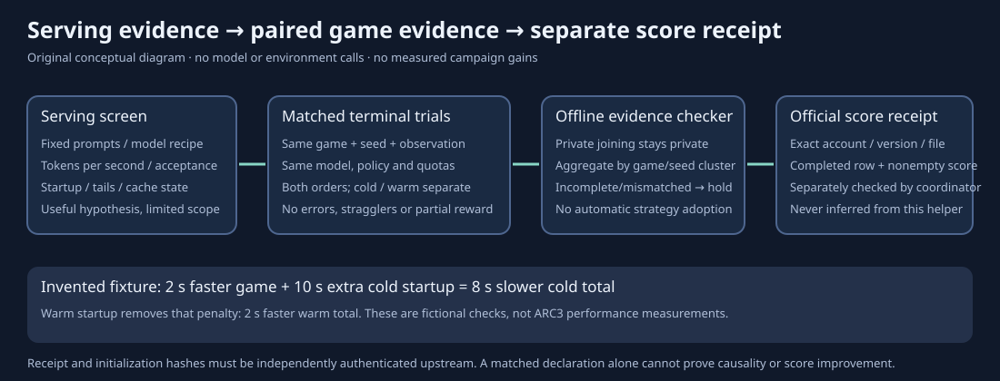

# Faster serving still needs fair game evidence

This original offline helper checks whether a steps-3 versus steps-4 experiment
has comparable, complete game trials. It calls no model, game environment,
network service or subprocess. It reports diagnostic aggregates and never adopts
a strategy automatically.

The inspected prepared benchmark runs a **fixed-prompt serving screen**. Its
candidate bytes and single active cell match their saved build hashes. Saved
test logs report `ALL PASS 56` in normal and `-O` modes, with 50 named `PASS`
lines in each. Those tests use a fake server; its dry run made zero SaveKernel
calls. None establishes native speed or game-score gains.

| Prepared design | What it establishes | What remains missing |
|---|---|---|
| Same ten replay payloads, model recipe and sampling settings | A controlled serving workload | Live game/seed and initial-observation pairing |
| Exactly two changed argument values | Steps 3/4 and corresponding draft tokens 4/5 | Full paired strategy outcomes |
| Equal planned request windows | Similar scheduled serving time | Equal completed effective spans and tail accounting |
| Steps 4 first, control second; one boot each | One directional serving comparison | Reverse order and matched startup state |
| Throughput, acceptance, error and KV checks | A serving-screen decision | Straggler, settled lifecycle and terminal evidence checks |

Prompt discovery does not require a fixed snapshot manifest. It uses an
unversioned mounted notebook output and accepts a matching prompt directory.
Text snapshots elide tool results and may insert a continuation note; they are
not reconstructed live game observations. Sampling uses temperature 0.7
without an explicit seed. Those details need binding before another experiment
is interpreted as a matched comparison.

## Match the experiment, rather than just its averages

The checker accepts a preregistered panel and normalized records. Each pair
must contain exactly one record for each arm, periods one and two, the same
public game key, game seed, LLM seed, startup state and initial-observation hash.
Every row must match the protocol's target, drafter, tokenizer, environment,
agent policy, sampling and non-step configuration hashes. These hashes are
declarations until independently checked against complete native receipts.

Both arms receive the same action, LLM-call, input-token, output-token and total
wall-time quotas. Actual usage must remain inside those ceilings. Total runtime
starts at the first statement and includes startup; startup and game runtime
are also reported separately. Missing counters, nonfinite values, excess usage,
errors, stragglers, unsettled lifecycle or intermediate rewards produce a hold.

Terminal records must be finalized and bind a receipt and terminal-state hash.
A declared budget stop must reach at least one registered quota. Merely writing
`terminal=true` cannot authenticate an environment outcome: upstream native
receipt verification remains necessary.

For every game/seed/startup stratum, the required repeats must include each arm
first equally often. Cold and warm results remain separate. Repeated trials
are averaged within a game/seed/LLM-seed cluster before reward aggregates are
reported; they do not become additional independent games. There is no p-value,
confidence interval, hidden-score estimate or automatic promotion gate here.
Initialization hashes are checked within each startup stratum. A cold-versus-warm
contrast additionally needs the same environment-reset/observation binding across
those strata; a shared seed alone does not establish equivalent starting states.

## Invented checks demonstrate why startup matters

Twenty-five checks passed in approximately 0.011 CPU seconds. They cover matched
fixtures, private-output exclusion, reverse input order, model/observation/quota
drift, nonterminal rewards, incomplete lifecycle, fixed order, missing arms,
missing panel members, nonfinite/overflow values and bool quota impersonation.

In the **invented** fixture, steps 4 saves two seconds of game runtime but costs
ten additional seconds to start cold. Its total cold runtime is eight seconds
longer; its warm runtime is two seconds shorter. These numbers illustrate a
confound and are not campaign measurements.

V1 source and its initial 23-check result remain preserved locally. V2 adds
strict numeric handling for overflow-sized values and bool quota fields; the
two added tests pass. This repair changes malformed-input validation only.
An independent reviewer reproduced the 25 author checks and passed 18 additional
invented checks. See `REVIEW_NOTE.md` and the scalar review summary for scope.

## Use with independently verified native receipts

Run the original invented controls with `python3 -B invented_checks_v2.py`.
The scalar output file must be absent; writes use exclusive creation. Use a
fresh directory for another run and preserve earlier artifacts.

`invented_checks_v2.fixture()` returns a complete fictional protocol and record
example in memory. Use it to understand the schema, then construct new private
normalized inputs from independently verified native receipts. Freeze the
panel, startup phases, repetitions, identity hashes and quotas before the run;
do not drop failed games afterward.

Run `python3 -B paired_evidence_v2.py --protocol protocol.json --records records.json
--output new-summary.json`. The output includes input-file hashes and aggregate
diagnostics only. It excludes game keys, seeds, pair IDs, prompts, observations
and individual rewards. A successful contract is labeled
`PAIRED_DIAGNOSTIC_READY`; any mismatch or missing evidence is a hold. Neither
label establishes a score gain.

The public packet contains original tools, invented controls, a conceptual
diagram, scalar source-audit facts and documentation. It excludes benchmark
prompts, models, game payloads, private receipts and notebook artifacts. Original
material is MIT; third-party model/framework/data terms are separate. No external
actions, native runs or score refreshes were performed by this audit.
