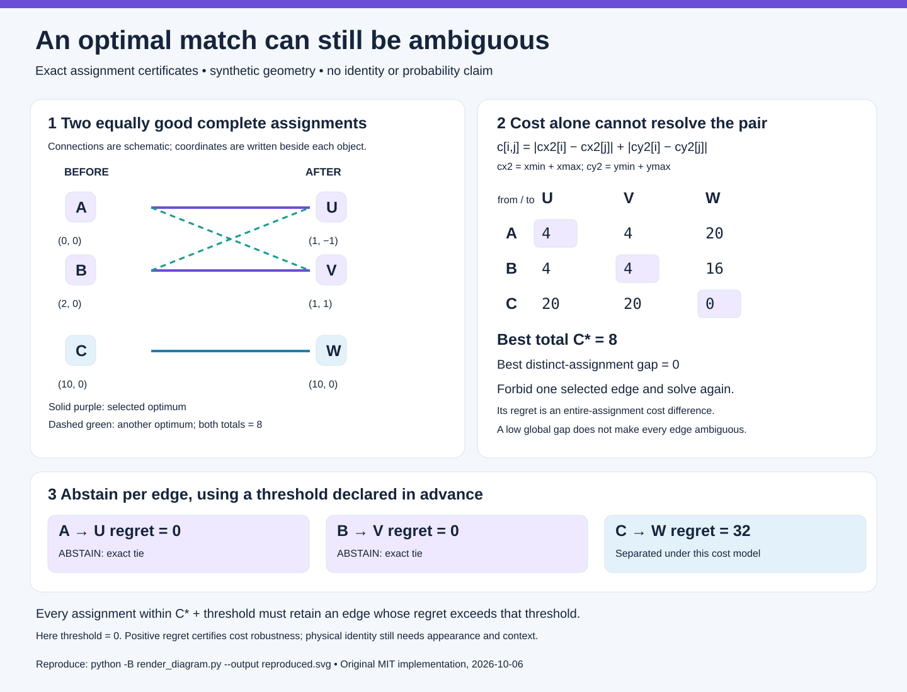

# When a good match is still ambiguous

An optimal object assignment can conceal several equally good explanations. This small CPU tool reports that ambiguity explicitly. It matches integer bounding-box centers, then asks how much the **whole assignment** must cost to avoid each selected edge. Exact ties and predeclared near ties cause that edge to abstain.



Everything here is synthetic and independently implemented. A positive gap establishes separation under the declared center-distance objective. It does **not** establish physical object identity, movement truth, or a probability of correctness. No competition model, game solution, notebook integration, native evaluation, or score improvement is included.

## Run it

Python 3.9 or later is sufficient; there are no third-party dependencies.

```sh
python -B example.py
python -B verify_correspondence.py
python -B -O verify_correspondence.py
```

The example has two objects that can swap assignments at no cost and one isolated anchor. Its best total is `8`, its best distinct-assignment gap is `0`, and its per-edge regrets are `0, 0, 32`. Only the tied pair abstains. The candidate displacement remains in the report for inspection; **an abstained candidate must never be reported as definite movement**.

```python
from correspondence import qualify_correspondence

before = [{"id": "A", "bbox": [0, 0, 0, 0]},
          {"id": "B", "bbox": [2, 0, 2, 0]}]
after = [{"id": "U", "bbox": [1, 0, 1, 0]},
         {"id": "V", "bbox": [2, 0, 2, 0]}]
report = qualify_correspondence(before, after, threshold2=4)
# Both selected edges have regret 4 and therefore ABSTAIN_NEAR_TIE.
```

Declare `threshold2` before examining the pair. It is an absolute budget in **doubled-center Manhattan units**, not a calibrated probability or a parameter fitted to official scores. With integer box extrema, all complete assignment costs have the same parity; finite regrets are even. Threshold `1` therefore has the same abstention behavior as `0`.

## Input contract

First partition objects into compatible appearance groups using information appropriate to the application, such as exact shape or color. This tool does not infer compatibility from distance. For each group, pass two lists or tuples of objects with **exactly** `id` and `bbox` keys:

- `id` is an exact, case-sensitive, unique string within its frame: 1–64 ASCII characters matching `[A-Za-z0-9][A-Za-z0-9_.:-]*`. IDs are sorted lexicographically. Nothing is normalized, coerced, trimmed, or generated from geometry; duplicate exact IDs are rejected. The same ID may appear in both frames, but that does not force a match.
- `bbox` is `[xmin, ymin, xmax, ymax]`, using **inclusive integer extrema**. A one-cell or point box may have equal extrema. Both axes must be ordered. Every coordinate is an exact Python `int` in `[-1_000_000_000, 1_000_000_000]`; Boolean and floating-point values are rejected.
- Both frames must have the same count, from `1` to `16`. Empty, unequal, oversized or malformed inputs return `HOLD` with a reason and **no partial correspondence**. Unequal counts commonly arise through birth, disappearance, occlusion, splitting or merging and need another model. Equal counts alone do not rule these events out.
- `threshold2` is an exact nonnegative Python integer. Unknown object keys and malformed late objects also cause `HOLD`.

The doubled center is `center2 = (xmin+xmax, ymin+ymax)`. For objects `i,j`, the exact cost is

```text
c[i,j] = abs(center2_before[i].x - center2_after[j].x)
       + abs(center2_before[i].y - center2_after[j].y)
```

Divide a reported cost, regret or displacement component by `2` to express it in ordinary coordinate units. The API never rounds half-integer centers or uses floating-point arithmetic.

## What the certificate proves

Let `P*` be the selected optimal permutation and `C*` its total cost. For a selected edge `e`, solve again with that edge forbidden:

```text
r[e] = min(cost(P) for assignments P excluding e) - C*
```

This is an **edge exclusion regret**, measured for the entire assignment. Replacing one edge can require a longer reassignment cycle. It is not a nearest-neighbor margin, and regrets must not be added to one another.

For a predeclared budget `B >= 0`, `r[e] > B` proves that every assignment costing at most `C*+B` retains `e`. A finite `r[e] <= B` means an alternative within that budget exists, so this policy abstains on the edge. The report distinguishes `ABSTAIN_TIE`, `ABSTAIN_NEAR_TIE`, and `SEPARATED_UNDER_COST_MODEL`.

Every permutation distinct from `P*` omits at least one selected edge. Conversely, every assignment omitting a selected edge is distinct. Taking the minimum over those sets proves

```text
best_distinct_assignment_cost - C* = min(r[e] for e in P*)
```

This **global best-distinct gap** includes zero-cost ties; it is not the gap to the next strictly larger objective value. It cannot substitute for the individual regrets. In the diagram the global gap is zero, but the isolated anchor remains separated.

For one object there is exactly one permutation. The alternate certificate, per-edge regret and global gap are `null`, `has_alternative_assignment` is `false`, and the decision is `ONLY_FEASIBLE_ASSIGNMENT`. This is a cardinality fact, not identity confidence. For `n >= 2`, a forbidden-edge alternative always exists in the complete finite matrix; a solver failure is an error rather than a fabricated no-alternative certificate.

Each optimization result includes its permutation, total, forbidden edge and integer row/column dual potentials. An independent checker verifies `u[i]+v[j] <= c[i,j]` on every allowed edge and that the dual total equals the recomputed primal total. Weak duality then certifies exact optimality. The checker in `verify_correspondence.py` does not call the assignment solver.

## Determinism, cost and limitations

The helper uses an independently written shortest-augmenting-path Hungarian solver, skipping the forbidden edge rather than inserting a numerical sentinel. Rows and columns follow exact sorted IDs; equal slacks choose the lowest column index. It selects a deterministic optimum, without promising the lexicographically smallest optimum. Reordering either input produces the same complete report.

One solve takes `O(n³)` arithmetic operations. The initial solve plus `n` edge-exclusion solves take `O(n⁴)`. The certificate payload stores `O(n²)` integers. The cap of 16 keeps this educational reference bounded. Python integers avoid fixed-width overflow; their bit-operation cost still depends on the integer magnitude. The lower-level `solve_assignment` accepts arbitrary nonnegative exact integer matrix costs and the same size cap; the coordinate limit applies specifically to `qualify_correspondence`.

Center distance ignores appearance, object extent, acceleration, camera motion, topology and occlusion. A crossing can have a unique geometrically cheap assignment that is physically wrong. Caller-defined compatibility groups can also be wrong. The returned displacements are candidates under this objective; neither a non-abstained edge nor a large regret turns them into verified motion. This tool does not model unmatched objects or set penalties for them.

## Verification and diagram reproduction

`verification_final.json` records **3,276 configured synthetic cases**: 722 assignment matrices checked by exhaustive permutation oracles; 2,477 geometric pairs checked by independent cost construction, all permutations and dual certificates; 36 reordered-input pairs; threshold boundaries; translation/scaling, singleton/coordinate/size boundaries; malformed-input refusals; tampered-certificate refusals; and nine independent checker-schema refusals. [EXECUTION_RECEIPT.json](EXECUTION_RECEIPT.json) pins the tested helper/verifier source hashes, actual interpreter versions, exit codes and matching result hashes: normal and optimized Python 3.12.14 and normal Python 3.9.6. These executions repeat the same configured suite; they are mathematical CPU checks, not evidence of game performance. [REVIEW.json](REVIEW.json) records the independent proof/code review; [RENDER_RECEIPT.json](RENDER_RECEIPT.json) pins the final renderer/SVG, runnable example check and existing-output refusal.

The matrix cases include all `2×2` matrices with entries `0,1,2` and all binary `3×3` matrices. Geometric cases include every pair of unordered two-point multisets from a `3×3` lattice and every pair of three-point multisets from a `2×2` lattice. Seeded larger tiny instances include exhaustive permutation oracles through six objects. At 16 objects, witnesses are checked directly by primal-dual inequalities rather than enumerating `16!` assignments. `check_certificate` independently validates and checks one assignment witness; it does not validate an entire serialized correspondence report. The configured geometry tests separately reconstruct report costs and check bindings and decisions.

The SVG is derived from `example_report()`. Render to a **new output path**, then compare with the distributed SVG:

```sh
python -B render_diagram.py --output reproduced.svg
python -B verify_correspondence.py --report fresh-verification.json
```

Output writers refuse an existing path. Run checks with `-B` to avoid creating bytecode cache files. See [PROVENANCE.md](PROVENANCE.md) for motivation, attribution and the original-source boundary; [LICENSE](LICENSE) covers the code, documentation and diagram.
